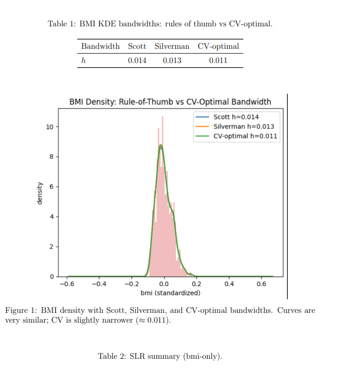

# Diabetes Progression and BMI Analysis

This project investigates whether Body Mass Index (BMI) is a robust predictor of 1-year diabetes progression using the canonical dataset from scikit-learn.
We combine distributional modeling (KDE), expressive visualization, and regression diagnostics (OLS, Ridge, Lasso, robust inference) to ensure statistical rigor.

------------------------------------------------------------
Project Overview
------------------------------------------------------------
- Dataset: sklearn.datasets.load_diabetes()
- Main Question: Does BMI at baseline explain variation in one-year diabetes progression?
- Methods:
  * Kernel Density Estimation (KDE) with bandwidth selection (Scott, Silverman, CV)
  * Simple Linear Regression with diagnostics (heteroskedasticity, Cook’s distance, QQ-plots)
  * Polynomial regression with cross-validation
  * Multiple regression with robust HC3 standard errors
  * Regularization (Ridge, Lasso)

------------------------------------------------------------
Key Findings
------------------------------------------------------------
- BMI is a strong positive predictor of diabetes progression.
- Simple regression shows heteroskedasticity → robust inference is required.
- No significant nonlinearity in BMI’s effect.
- Multivariate models (Ridge/Lasso) improve prediction accuracy compared to BMI-only models.
- BMI coefficients are stable across OLS, Ridge, Lasso (~520).

------------------------------------------------------------
Repository Structure
------------------------------------------------------------
project_code.ipynb   - Main Jupyter Notebook with analysis
Report.pdf           - Full report with figures, results, interpretation
/images              - Example screenshots/plots from the report
README.md            - Project documentation

------------------------------------------------------------
Report part
------------------------------------------------------------

------------------------------------------------------------
Installation
------------------------------------------------------------
Clone the repository and install dependencies:

git clone https://github.com/Gabrielprogramist/diabetes-bmi-progression.git
cd diabetes-bmi-progression

------------------------------------------------------------
Usage
------------------------------------------------------------
Open the notebook:

jupyter notebook project_code.ipynb

------------------------------------------------------------
References
------------------------------------------------------------
- Diabetes dataset: sklearn.datasets.load_diabetes
- Statistical methods: Breusch–Pagan test, HC3 robust SE, Ridge/Lasso regularization

------------------------------------------------------------
License
------------------------------------------------------------
MIT License – feel free to use and modify with attribution.
